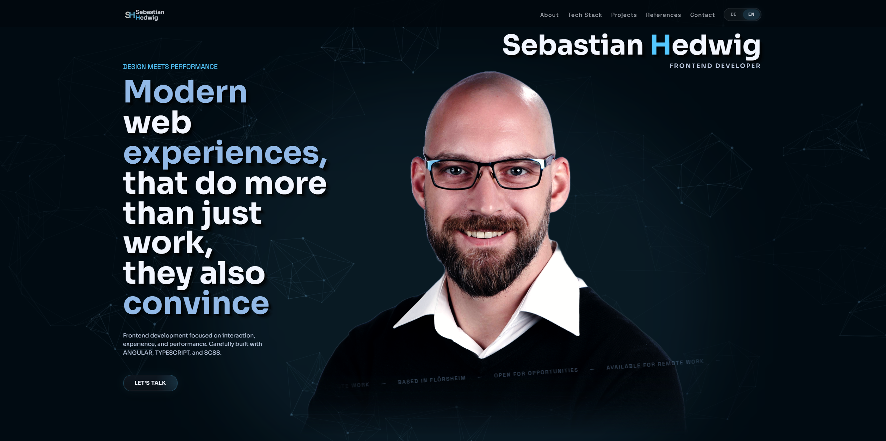

# Sebastian Hedwig Portfolio

Personal portfolio website for Sebastian Hedwig, Frontend Developer. The site presents profile information, tech stack, selected projects, references, and contact options in a bilingual Angular application.



## Overview

This portfolio is built as a focused single-page experience with additional legal pages. The landing page combines a visual hero stage, animated background elements, structured content sections, localized copy, project showcases, and a contact area.

The application is designed to communicate frontend work with an emphasis on interaction, performance, maintainable structure, and polished UI execution.

## Focus

- Modern landing page structure with hero, about, tech stack, projects, references, and contact sections
- Language switching for German and English through localized routes
- Animated, interactive interface built with GSAP and Three.js
- Responsive SCSS architecture with shared tokens, mixins, and component styles
- SEO-minded foundation with sitemap, robots file, imprint, and privacy pages

## Features

- Bilingual routing for `de` and `en`
- Preferred-language redirect from the root route
- Modular landing page sections with isolated data files
- Responsive desktop and mobile header/footer components
- Interactive network-style viewport background
- Scroll-based reveal animations
- Project previews with dedicated images, descriptions, stack data, and GitHub links
- Locally bundled fonts and static image assets
- Contact service foundation for form handling

## Tech Stack

- Angular 21
- TypeScript
- SCSS
- GSAP
- Three.js
- RxJS
- npm

## Routes

| Route | Purpose |
| --- | --- |
| `/` | Redirects to the preferred language |
| `/de` | German landing page |
| `/en` | English landing page |
| `/de/impressum` | German imprint page |
| `/en/impressum` | English imprint page |
| `/de/datenschutz` | German privacy page |
| `/en/datenschutz` | English privacy page |

## Project Structure

```text
src/
  app/
    pages/          Pages such as landing page, imprint, and privacy
    sections/       Portfolio sections used on the landing page
    shared/         Shared components, animations, navigation, and SEO
    i18n/           Language model, routing, and language state
  assets/
    icons/          Logo, button, footer, and tech stack icons
    images/         Portrait, about, project, and README images
    fonts/          Locally bundled fonts
  scss/             Global SCSS base, tokens, mixins, and component styles
public/             Favicon, robots.txt, and sitemap.xml
```

## Scripts

| Command | Description |
| --- | --- |
| `npm start` | Starts the Angular development server and opens the app |
| `npm run build` | Creates a production build |
| `npm run watch` | Builds continuously in development mode |
| `npm test` | Runs Angular tests |
| `npm run ng` | Runs the Angular CLI through npm |

## Local Development

Install dependencies:

```bash
npm install
```

Start the development server:

```bash
npm start
```

The app then runs locally at `http://localhost:4200/` and redirects to the matching route based on the preferred language.

## Build

Create a production build:

```bash
npm run build
```

Build artifacts are written to the `dist/` directory.

## Tests

Run the test suite with:

```bash
npm test
```

## Content

Most visible copy is stored as structured data in the corresponding `*.data.de.ts` and `*.data.en.ts` files. This keeps both language versions easy to maintain without changing component logic.

Typical content entry points:

- Hero copy and identity data: `src/app/sections/hero/hero.data.*.ts`
- About section copy: `src/app/sections/about/about.data.*.ts`
- Tech stack data: `src/app/sections/tech-stack/tech-stack.data.*.ts`
- Project data: `src/app/sections/projects/projects.data.*.ts`
- References data: `src/app/sections/references/references.data.*.ts`
- Contact copy: `src/app/sections/contact/contact.data.*.ts`
- Footer copy: `src/app/pages/landing/data/footer/landing-footer.data.*.ts`

## Styling and Assets

Global styling lives in `src/scss`, split into abstracts, base styles, and reusable component-level SCSS. The Angular application imports the global stylesheet through `src/styles.scss`.

Images, icons, and fonts are stored under `src/assets` and copied into the build output through the Angular asset configuration. Public files such as `robots.txt`, `sitemap.xml`, and the favicon live in `public`.

## Maintenance Notes

- Keep German and English data files in sync when adding or changing visible copy.
- Add new project screenshots under `src/assets/images/projects`.
- Add README-specific images under `src/assets/images/readme`.
- Update `public/sitemap.xml` when public routes change.
- Run `npm run build` before publishing changes.
